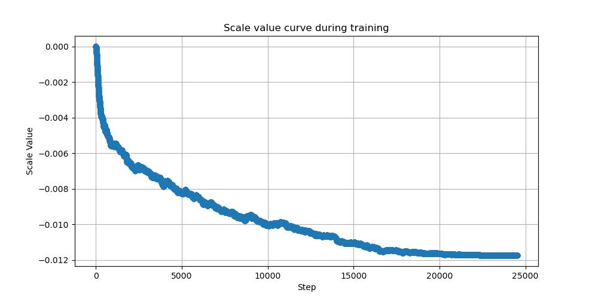
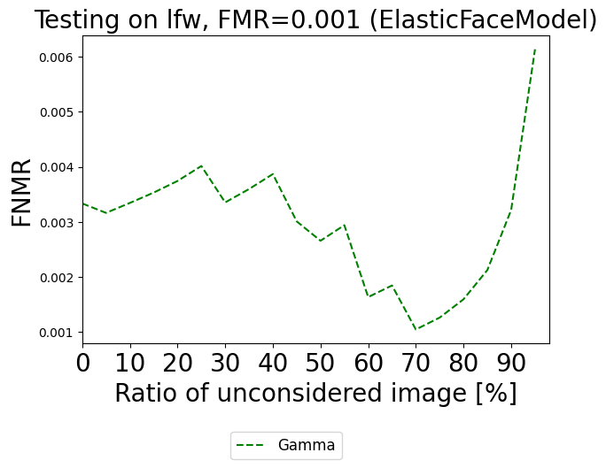

# Rebuttal of Paper 5383

Figure 1: The merging weight change curve during training. The absolute value of the merging weight increases gradually and eventually stabilize. This means that the adaptive expert is constantly fitting the bias between different datasets. The merging weight is negative, suggesting that the adaptive experts remove the preference scores from the shared experts, similar to a denoising process.

Figure 2: The Error vs. Reject Curves (ERC). We use ElasticFaceModel as the face recognition algorithm. The False Match Rate (FMR) is 1e−3 and dataset is LFW.

